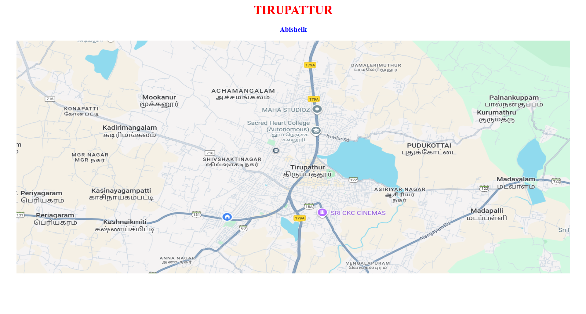
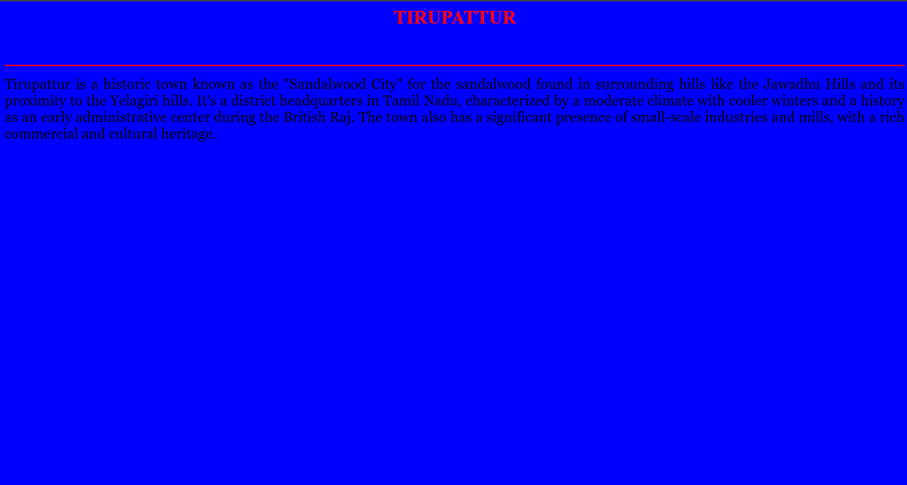
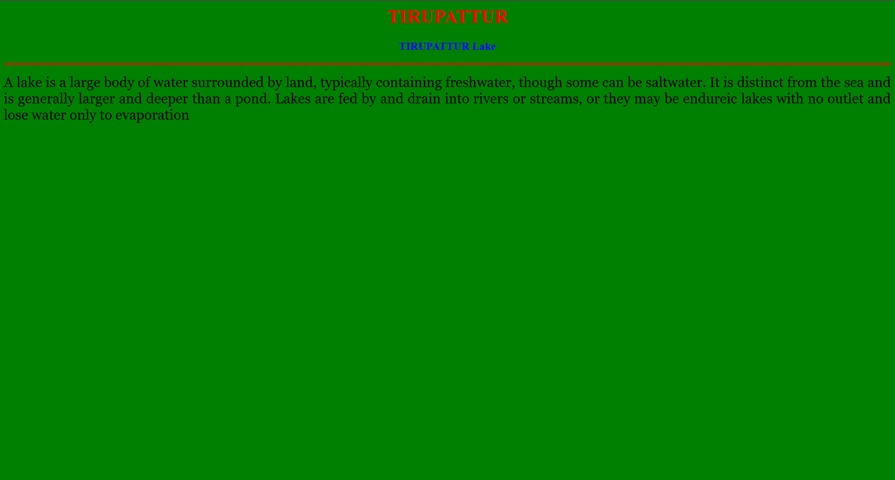
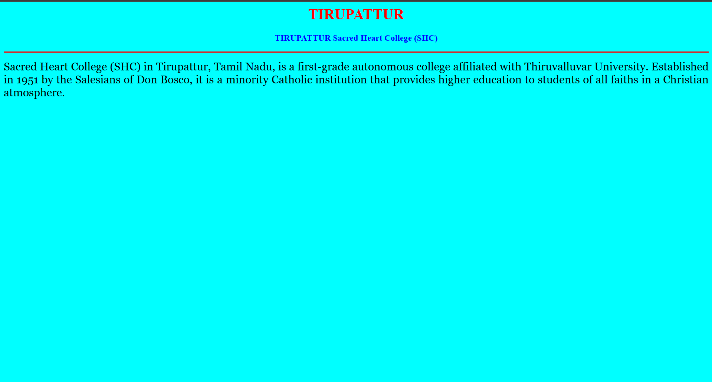

# Ex04 Places Around Me
## Date:16/11/2025

## AIM
To develop a website to display details about the places around my house.

## DESIGN STEPS

### STEP 1
Create a Django admin interface.

### STEP 2
Download your city map from Google.

### STEP 3
Using ```<map>``` tag name the map.

### STEP 4
Create clickable regions in the image using ```<area>``` tag.

### STEP 5
Write HTML programs for all the regions identified.

### STEP 6
Execute the programs and publish them.

## CODE

## map.html
```
<html>
    <head>
        <title>My City</title>
    </head>
    <body>
        <h1 align="center">
        <font color="red"><b>TIRUPATTUR</b></font>
        </h1>
        <h3 align="center">
        <font color="blue"><b>Abisheik</b></font>
        </h3>
        <center>
            
            <map name="MyCity">
            <area shape="rect" coords="700,250,850,400" href="home.html" title="My HomeTown">
            <area shape="rect" coords="804,444,1025,521" href="movie.html" title="SRI CKC CINEMAS">
            <area shape="cricle" coords="823,296,1090,473" href="lake.html" title="TIRUPATTUR Lake">
            <area shape="rect" coords="545,212,808,363" href="college.html" title="sacred heart college">
            </map>
        </center>
    </body>
</html>
```
## movie.html
```
<html>
<head>

<title>My Home Town</title>

</head>
<body bgcolor="yellow">
<h1 align="center">
<font color="red"><b>TIRUPATTUR</b></font>
</h1>

<h3 align="center">

<font color="blue"><b>TIRUPATTUR movie</b></font>

</h3>

<hr size="3" color="red">

<p align="justify">

<font face="Georgia" size="5">
Sri CKC Cinemas is a renovated cinema in Tirupattur that offers a modern movie experience with amenities like air conditioning, 
4K projection, RGB laser technology, and Dolby Atmos sound. It is located at CKC Nagar and provides comfortable seating, parking, 
and food and beverages. 
</font>

</p>

</body>

</html>
```
## lake.html
```
<html>
<head>

<title>My Home Town</title>

</head>
<body bgcolor="GREEN">
<h1 align="center">
<font color="red"><b>TIRUPATTUR</b></font>
</h1>

<h3 align="center">

<font color="blue"><b>TIRUPATTUR Lake</b></font>

</h3>

<hr size="3" color="red">

<p align="justify">

<font face="Georgia" size="5">
A lake is a large body of water surrounded by land, typically containing freshwater, though some can be saltwater. 
It is distinct from the sea and is generally larger and deeper than a pond. Lakes are fed by and drain into rivers or streams,
 or they may be endureic lakes with no outlet and lose water only to evaporation
</font>

</p>

</body>

</html>
```
## home.html
```
<html>
<head>

<title>My Home Town</title>

</head>
<body bgcolor="Blue">
<h1 align="center">
<font color="red"><b>TIRUPATTUR</b></font>
</h1>

<h3 align="center">

<font color="blue"><b>TIRUPATTUR My Home Town</b></font>

</h3>

<hr size="3" color="red">

<p align="justify">

<font face="Georgia" size="5">
Tirupattur is a historic town known as the "Sandalwood City" for the sandalwood found in surrounding hills like the Jawadhu Hills and its proximity to the Yelagiri hills. 
It's a district headquarters in Tamil Nadu, characterized by a moderate climate with cooler winters and a history as an early administrative center during the British Raj. 
The town also has a significant presence of small-scale industries and mills, with a rich commercial and cultural heritage. 
</font>

</p>

</body>

</html>
```
## college.html
```
<html>
<head>

<title>My Home Town</title>

</head>
<body bgcolor="cyan">
<h1 align="center">
<font color="red"><b>TIRUPATTUR</b></font>
</h1>

<h3 align="center">

<font color="blue"><b>TIRUPATTUR Sacred Heart College (SHC)</b></font>

</h3>

<hr size="3" color="red">

<p align="justify">

<font face="Georgia" size="5">
    Sacred Heart College (SHC) in Tirupattur, Tamil Nadu, is a first-grade autonomous college affiliated with Thiruvalluvar University. 
    Established in 1951 by the Salesians of Don Bosco, it is a minority Catholic institution that provides higher education to students 
    of all faiths in a Christian atmosphere.
</font>

</p>

</body>

</html>
```

## OUTPUT







## RESULT
The program for implementing image maps using HTML is executed successfully.
